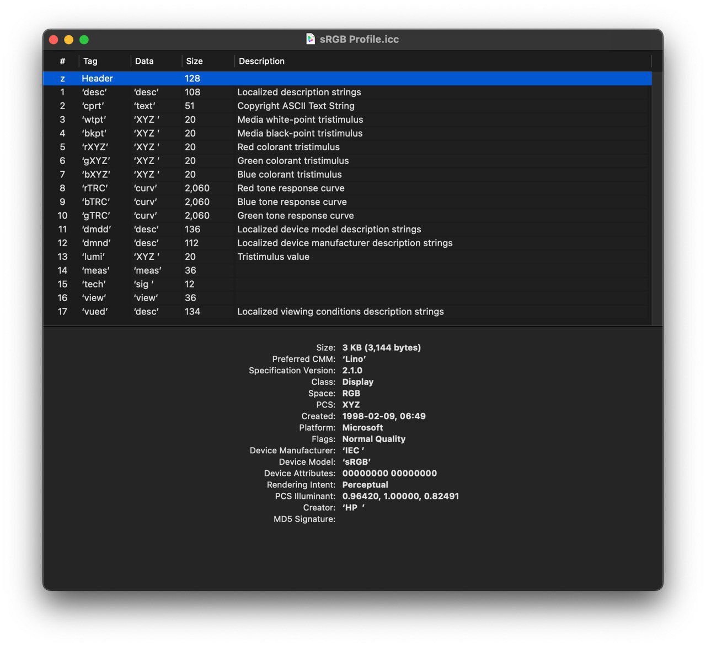

ICC Profile 这个文件本身其实是一个 binary 二进制文件。我们打开 macOS 里的 ColorSync Utility 软件，随便打开一个 Profile，比如 sRGB IEC61966-2.1。这时弹出来一个窗口：

这个窗口其实就是对 sRGB IEC61966-2.1 这个 ICC Profile 的 parser，它 parse 出来文件头、各种标签等等。

---

对普通显示器校色的时候，很难不碰到 [ICC profile](https://en.wikipedia.org/wiki/ICC_profile) 这个东西。我们都知道这个名词，显示器的 ICC 文件，或许模糊的对它有一些概念。但它究竟是什么？原理如何。

ICC Profile 跟我们已经有很明确概念的 ACES，或者更广泛一些地讲：“现代的色彩管理流程”，是很相似的 idea。都有一个处于整个链路中间的非常大的色彩空间，大到足以容纳所有不同的输入、显示和输出设备的各种色域（sRGB、AdobeRGB、Rec.709 等等）[^1]。这个色彩空间在 ICC 这个概念下叫作 PCS（Profile Connection Space）。ICC profile 通过定义设备源或目标色彩空间与 PCS 之间的**映射**来描述特定设备的色彩属性[^2]。

ICC 本身并不进行任何校准，它们只包含显示器关于色彩成像能力的数据。这些数据用于帮助可以识别 ICC profile 的软件（我们叫它 ICC aware 的软件）通过 CMM（色彩管理模块）对图像进行调整，以尝试纠正显示器的色偏来进行校准。ICC profile 完成的实际上是对**图像的调整**，而不是对显示器的校正。不同的软件使用不同的 CMM 的话，即使都采用同一个 ICC，最终出来的结果也可能不一样。

[^1]: [ICC Profile](https://www.ibm.com/docs/en/i/7.4?topic=management-icc-profiles) - IBM
[^2]: [ICC profile](https://en.wikipedia.org/wiki/ICC_profile) - Wikipedia
