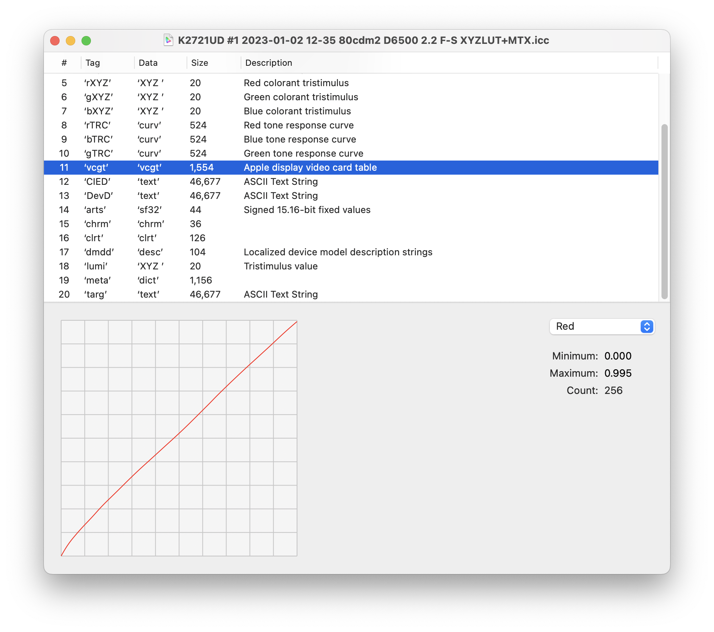

之前我们知道，DisplayCAL 这种校色软件的工作原理：它会生成一个配置文件，在系统里加载，实际作用到显卡的输出信号上。更细节一点则是：

DisplayCAL 生成的 ICC 配置文件中会包含一个叫作 VCGT（Video Card Gamma Table）的 tag，它实际是一个 1D LUT，包含对显示器的灰阶或白点的校正。然后操作系统需要把这个 VCGT Tag 加载到显卡输出信号上的有一个 Look Up Table 上，从而实现对显卡输出信号的校正。同时显卡的这个 Look Up Table 也是有精度限制的。

具体在使用 DisplayCAL 的时候，右键桌面右下角 DisplayCAL 的图标，就会看到有一个 Reset video card gamma table 的东西。在系统加载了 DisplayCAL 生成的 profile 的情况下，这时点一下 Reset video card gamma table 会发现整个桌面的反差，或者说 Gamma、灰阶变了，它把对于显卡的校正给重置掉了，回到了最初的状态。

再者就是我们还可以在 DisplayCAL 的 Tone curve 的设置中看到：如果不把 Tone curve 设为 “As measured” 的话，比如手动设为 Gamma 2.2。那 DisplayCAL 会做这么一件事情：在校准过程中，会通过一个 1D LUT 来校准（中和、补偿）显示器本身与这条纯粹的、Gamma 为 2.2 的指数曲线不相符的地方。如果设为 “As measured” 的话，则显示器的 grey scale 是怎么样就是怎么样，不做任何的校准和调整。

总的来说：

- VCGT Tag 是一个 1D LUT，包含灰阶和白点的校准信息。是使用 DisplayCAL 这种软件校准时，实际起校准作用的环节。相对可感的。
- VCGT 并不包含在 ICC 的标准中，因此有的软件可能把 VCGT（1D LUT）包含在了 ICC 配置文件当中，DisplayCAL 就是如此。有的软件可能包含在别的地方。
